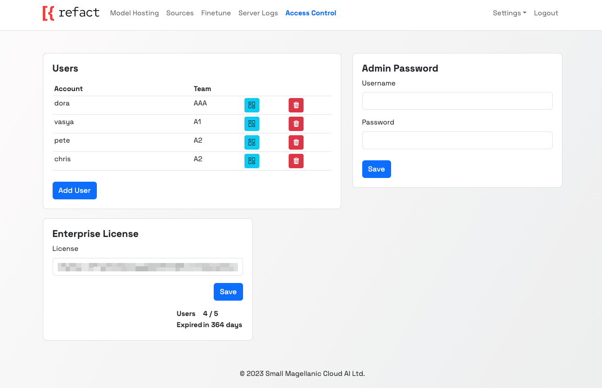

Enterprise self-hosted version of Refact allows you to fine-tune your company's code model and manage access to it. Enetrprise plan is designed for teams who want to have full control over their Refact experience and access to all features.

## Install Docker

First, run the following in your terminal:

```bash
docker pull smallcloud/refact_self_hosting:nightly
docker pull smallcloud/refact_self_hosting_enterprise:beta
```

Next step is to run the `docker compose up` command in your terminal.

:::note
To successfuly complete this step you need to use `1.29.2` version of `docker-compose`.
:::

## Login

To access the dashboard with the enterprise plan you need to complete the authentication flow.


### Access control

Managing access is possible through the `Access Control` tab.


Access control tab contains the following:
- `Users` - list of all users. Each user has an `id`, `team` and an `API Key`.
- `Enterprise License` - panel where the license can be activated.
- `Admin Password` - panel where the admin credentianls can be modified.



## Activating the License

To activate the enterprise plan with a license [contact us](https://refact.ai/contact/). Refact team will arrange it for you.


## VLLM 
With enterprise version of Refact you can use vLLM Refact model.

vLLM offers a faster inference speed and better accuracy.

### Enabling vLLM 

To enable vLLM navigate to the `Model Hosting` page and click the `Add Model` button. 

in the list of available models select the `Refact/1.6B/vllm` model.
